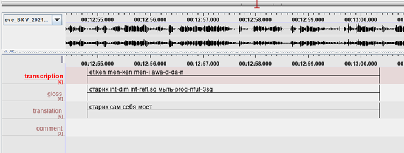
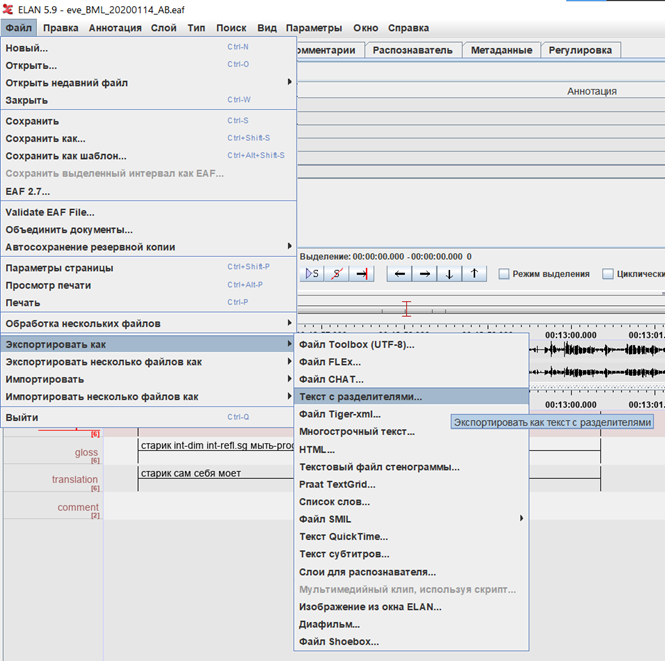
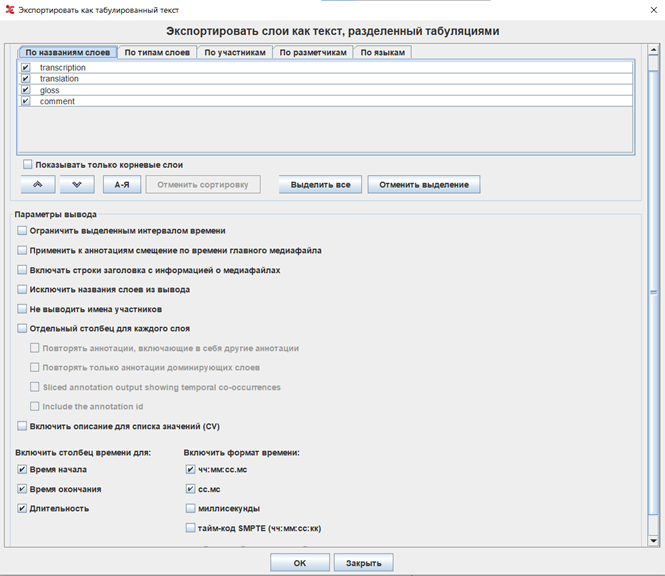

# Elan-to-Word converter

This tool allows to convert delimited text exported from ELAN into `.docx`.

##Instruction

* Annotate your text using ELAN. Layers are the following:
  * transcription (phonetic form of sentences)
  * gloss (morphemes annotation)
  * translation
  * comment (any additional information)

Example file is provided (`example.eaf`). Here is a screenshot.

* Export as delimited file.

  

  * Leave all fields (except time) empty. For time, separate column for duration
  and ss.ms time format are optional (BUT must be either both checked
  or both empty. To be on the safe side, just do as is shown on the screenshot below.)
  
  
  
  * Example file for delimited text is also provided (`example.txt`)

* Run `converter.py` and follow instructions from there.
* Voilà!

* Also, you can run a web application using the `flask_version` directory.

